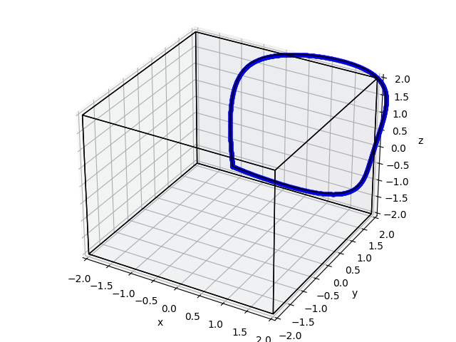
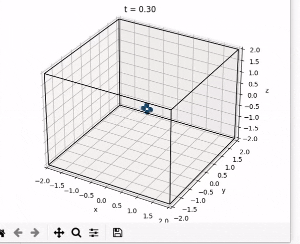
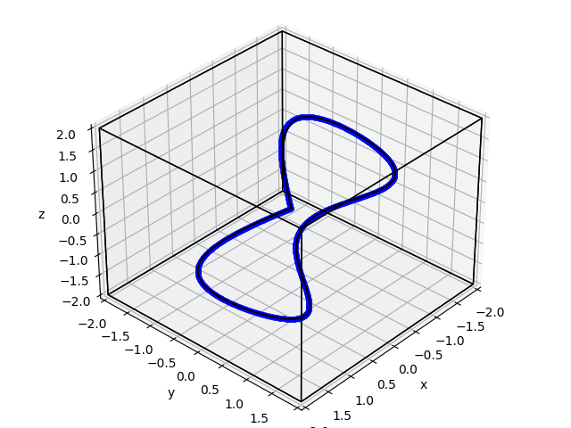

# Quadrotor-Planning-and-Control

As a part of Advance Robotics course at Penn (MEAM 620), python code was written for the following
- Linear Backstepping PD Controller
- A* and Dijkstra path planning algorithms
- Minimum snap trajectory optimisation

Some results are shown below

### PD Controller

- Trajectory followed

- Animation

### Minimum snap trajectory

- Trajectory followed

- Animation

